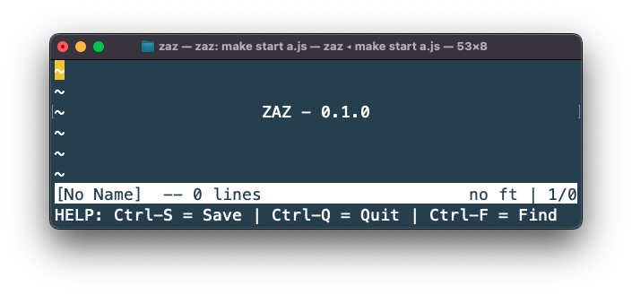

# Zaz

Small Rust Editor made for terminal usage



## Installing:

```bash
curl 
```

## Development

To run it locally, clone the repository and run the following command in the root:

```bash
make start
```

## References

- https://viewsourcecode.org/snaptoken/kilo/index.html
- https://github.com/Kofituo/pound